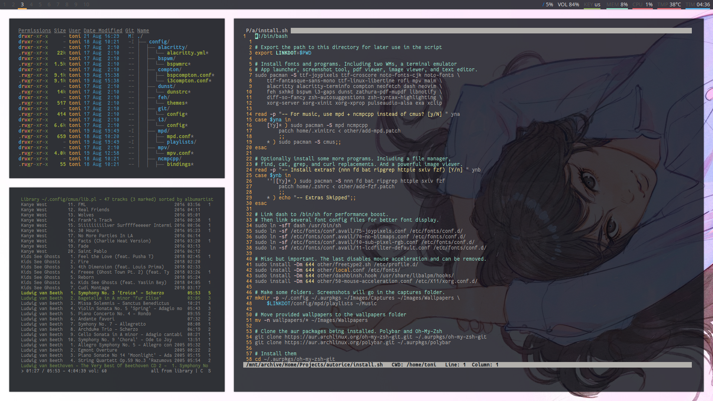
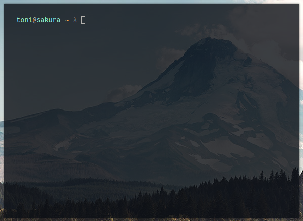
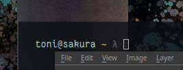
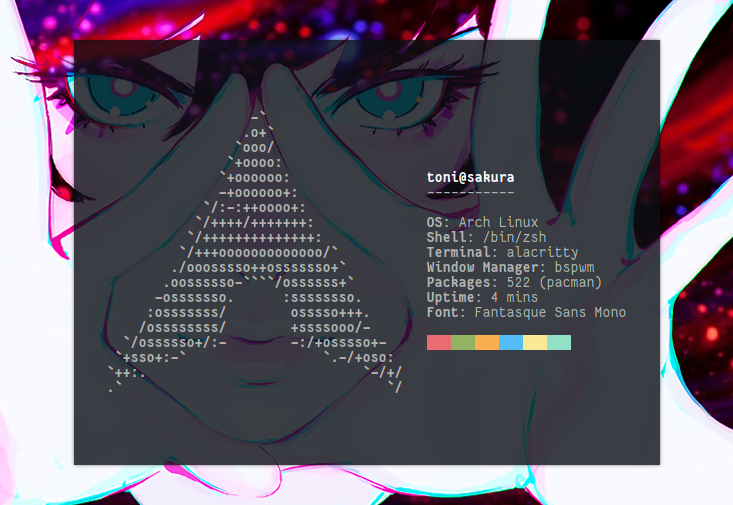

### A stylish setup that's ready for work in minutes.

### No borders for a light, pastoral mood.

### Polybar for your system info, and workspaces.

### Font display has been corrected. No ugly blocky UIs.

### Support for every language in the world.

### On the simple but powerful Arch Linux.

### Introduction 

With this project, I set out to create something that would alleviate the incredible time sink of setting up Arch Linux. After nearly a month of work, this is what I have come up with. 

Programs have been chosen carefully based on their performance and utility. At the same time, not too many are included. To keep it lean, command line tools make up the majority of what you will be getting. It's up to you to install the rest. 

**Default programs**

* **Window Manager**: i3-gaps
* **Window Manager**: bspwm
* **Terminal**: Alacritty
* **Status Bar**: Polybar
* **Shell**: Oh My Zsh 
* **App Launcher**: Rofi
* **System Info**: Neofetch
* **Text Editor**: Neovim
* **Hotkey Daemon**: sxhkd
* **Notifications**: dunst
* **PDF Reader**: zathura
* **Screenshot Tool**: maim
* **Image Viewer**: feh
* **Video Player**: mpv
* **Music Player**: cmus
* **ls**: exa 

**Optional Programs**

* **Fuzzy Search**: fzf
* **File Manager**: nnn
* **Image Viewer**: sxiv
* **Music Daemon**: mpd
* **Music Player**: ncmpcpp
* **find**: fd
* **grep**: ripgrep
* **curl**: httpie
* **cat**: bat

### Installation

This little script will install a collection of command line tools, two window managers, and a terminal emulator. Installation is easy:

1. Install Arch Linux and make sure you have `base-devel` and `git` packages.
2. `git clone https://github.com/tonijarjour/autorice.git .dotfiles`
3. `cd .dotfiles` (You **must** be inside the cloned directory)
4. `sh install.sh`
5. Restart your computer after the script finishes.

### Usage

This script does nothing past providing you with dotfiles for the programs it installs. There is no universal config file, nor a master settings panel. Its up to you to configure and learn everything you need.

With that said. There are some important aspects that should give some comfort:

1. Everything is *nearly* default. 
2. No magic. The dotfiles are organized in the simplest and most logical structure possible. 
3. Theres not much here. You can look through everything in about an hour. 
4. Two window managers: bspwm (tty1) and i3 (tty2) to fit most preferences. 

With those three points laid out, here are some basic keybindings to help you out:

**Global**

* `mod return` to start a Terminal.
* `mod space` to use the app launcher.
* `mod h,j,k,l` to move between windows.
* `mod 1,2,3...` to move between workspaces.
* `mod shift h,j,k,l` to swap window positions.
* `mod shift 1,2,3...` to send a window to a workspace.
* `mod alt w` to load a new random wallpaper.
* `mod printscreen` to select an area to capture. 
* `printscreen` to take a screenshot.
* `mod left click` to move a floating window.
* `mod right click` to resize windows.
* `mod escape` to reload the hotkey config.

**bspwm**

* `mod arrow keys` to move a floating window in bspwm.
* `mod w` to close a window in bspwm.
* `mod alt r` to restart bspwm.
* `mod alt q` to quit out of bspwm.
* `mod s,t,f,m` to make a window stack (float), tile, fullscreen, monocole in bspwm.
* `mod c` to cycle through windows in bspwm.
* `mod alt h,j,k,l` to make a window larger in bspwm.
* `mod shift alt h,j,k,l` to make a window smaller in bspwm.

**i3**

* `mod shift r` to restart i3.
* `mod shift c` to reload i3 config.
* `mod shift e` to quit out of i3.
* `mod shift q` to close a window in i3.
* `mod semicolon,v` to split a window horizontally, vertically in i3.
* `mod f` to toggle fullscreen in i3.
* `mod shift space` to toggle a window to float or tile in i3.
* `mod c` to toggle focus between floating and tiled windows in i3.
* `mod r` to enter resize mode in i3.
* `mod h,j,k,l` to shrink and grow a window (while in resize mode) in i3.

### Something doesn't work. 

**Please** open an issue and tell me what happened. My goal is to make this work for everyone and that starts with fixing every little problem people have.

