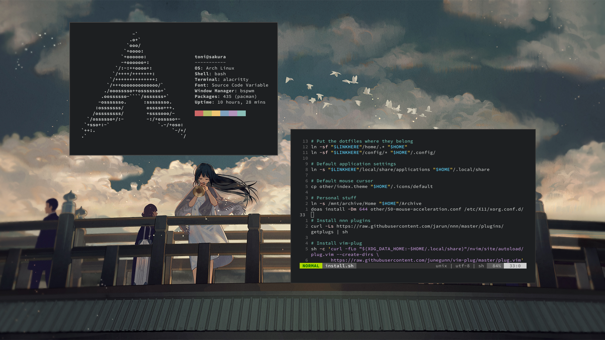
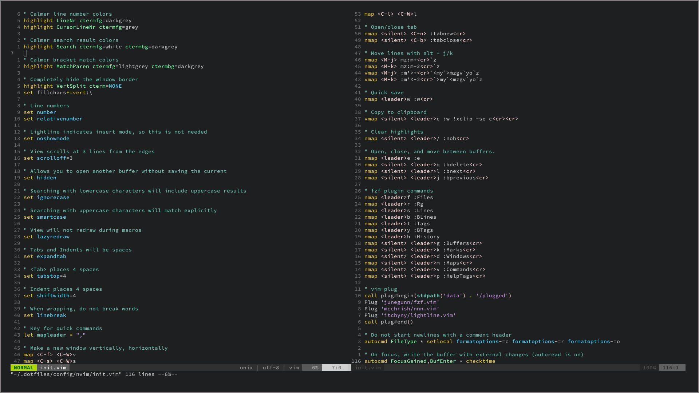

This is a simple Arch Linux auto ricing script. It is mostly defaults save for neovim, which has been customized heavily. The script can't hold your hand, so you'll have to read the files to see what is going on, and to change it.

## Installation
1. Install any distro that uses pacman (Arch, Artix)
2. Make a new test user (or use your own):
```
# Bash as the default shell is required. 
# Group wheel is not required, but you'll have to install the programs manually.

useradd -m -g wheel -s /bin/bash username
passwd username
```
3. Sign into that user and clone this repo:
```
# This should not be deleted, so best to have it hidden.

git clone https://github.com/tonijarjour/autorice.git ~/.dotfiles
```
4. Read everything in `home` and `install.sh` to understand what you are getting.
5. If you've never used bspwm, also read `config/sxhkd/sxhkdrc` and `config/bspwm/bspwmrc`.
6. Run `bash install.sh`, then reboot once the script finishes.

### Neovim
1. Start `nvim` and run `:PlugInstall` to enable the plugins.
2. Read `config/nvim/init.vim` to learn about the customizations and keybinds.

### Aliases
Aliases are in the `home/.aliases` file. Take a look and decide if you like what you see.

### fzf
`fzf` has been heavily integrated into the shell and `nvim`. It has been setup to use `fd` results instead of `find`. Use `Ctrl-t` to search for files, `Ctrl-r` to search through command history, and `Alt-c` to search for a directory to cd into.

### Others
More comfortable keybinds have been provided for mpv and zathura. 
