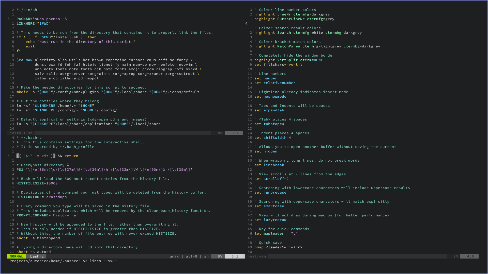

This is a simple Arch Linux auto ricing script. It is great for quickly setting up a working envornemnt on a new Arch installation, or as a canvas for further personal customization. Here is a list of programs:

- **Interactive Shell**: Bash
- **Text Editor**: Neovim 
- **Window Manager**: bspwm
- **Hotkey Manager**: sxhkd
- **Terminal Emulator**: Alacritty
- **File Manager**: nnn
- **Music Player**: cmus
- **Media Player**: mpv
- **PDF Reader**: Zathura
- **Image Viewer**: sxiv, feh
- **Application Launcher**: Rofi
- **Unicode Coverage**: Noto Fonts
- **Terminal Font**: Source Code Pro
- **Screenshot**: maim
- **Notifications**: Dunst
- **Clipboard Manager**: xclip
- **Search Tool**: fzf

Many other terminal based programs are included. Read `install.sh` for a full list.

## Installation
0. I recommend reading the files before installing it.
1. Install Arch/Artix Linux (or anything that you know will work).
2. Make a new test user (or use your own):
```
# Bash as the default shell is required. 
# Group wheel is not required, but you'll have to install the programs manually.

useradd -m -g wheel -s /bin/bash username
passwd username
```
3. Sign into that user and clone this repo:
```
# This should not be deleted, so best to have it hidden.

git clone https://github.com/tonijarjour/autorice.git ~/.dotfiles
```
4. Run `bash install.sh`, then reboot once the script finishes.

### Neovim
1. Start `nvim` and run `:PlugInstall` to enable the plugins.
2. Read `config/nvim/init.vim` to learn about the customizations.


### Feedback and bug reporting
Please open an issue if you find something wrong or have suggestions for how this could improve.
