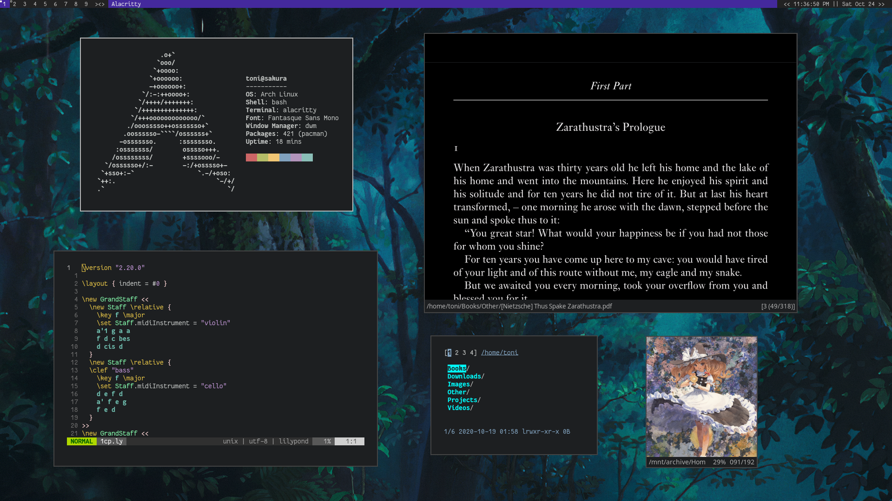

### Introduction 

This is an extremely simple autoricer. Here's a list of the programs you get:

* Emoji: Joypixels
* MS Metric fonts: Croscore Fonts
* Unicode: Noto Fonts
* Terminal Font: Fantasque Sans Mono
* Apps Menu: Rofi
* Terminal Emulator: Alacritty
* Text Editor: Neovim
* PDF Reader: Zathura
* Video player: mpv
* Image Viewer: feh
* Window manager: bspwm
* Hotkey manager: sxhkd
* Notifications: dunst
* Search: fzf
* Clipboard: xclip
* Screenshot: maim
* System Info: neofetch

### Installation

1. Install Arch Linux and a graphics driver.
2. Edit `install.sh` and `config/bspwm/bspwmrc` to your specification.
3. Check on everything else and change it if you want.
4. `bash install.sh` Reboot when finished. 

### Usage

List of hotkeys (most are bspwm defaults):

**Global**

* `mod return` to start a Terminal.
* `mod space` to use the app launcher.
* `mod h,j,k,l` to move between windows.
* `mod 1,2,3...` to move between workspaces.
* `mod shift h,j,k,l` to swap window positions.
* `mod shift 1,2,3...` to send a window to a workspace.
* `mod alt w` to load a new random wallpaper.
* `mod printscreen` to select an area to save as an image. 
* `printscreen` to save a full screenshot.
* `mod shift printscreen` to select an area to clipboard. 
* `shift printscreen` to clipboard a full screenshot.
* `mod left click` to move a floating window.
* `mod right click` to resize windows.
* `mod escape` to reload the hotkey config.
* `mod arrow keys` to move a floating window.
* `mod w` to close a window.
* `mod alt r` to restart.
* `mod alt q` to logout.
* `mod s,t,f,m` to make a window stack (float), tile, fullscreen, monocole. 
* `mod c` to cycle through windows.
* `mod alt h,j,k,l` to make a window larger.
* `mod shift alt h,j,k,l` to make a window smaller.

### Something doesn't work. 

**Please** open an issue and tell me what happened. My goal is to make this work for everyone and that starts with fixing every little problem people have.

