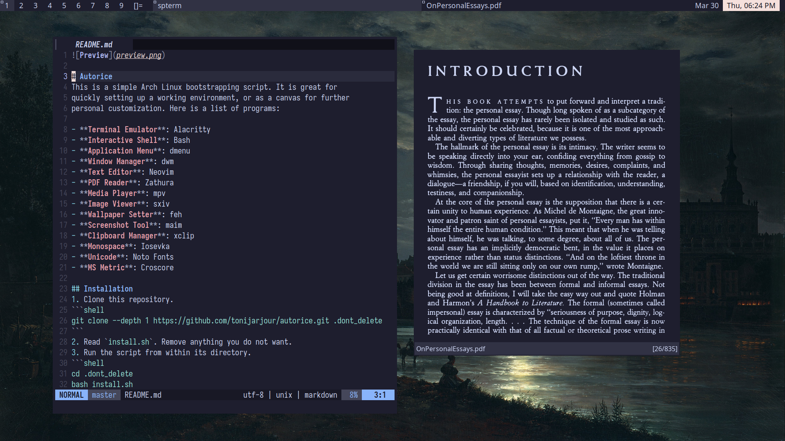

# Autorice
This is a simple Arch Linux bootstrapping script. It is great for quickly 
setting up a working environment, or as a canvas for further personal 
customization. Here is a list of programs:

- **Terminal Emulator**: Alacritty
- **Interactive Shell**: Bash
- **Application Menu**: dmenu
- **Window Manager**: dwm
- **Text Editor**: Neovim 
- **PDF Reader**: Zathura
- **Media Player**: mpv
- **Image Viewer**: sxiv
- **Wallpaper Setter**: feh
- **Screenshot Tool**: maim
- **Clipboard Manager**: xclip
- **Monospace**: Iosevka 
- **Unicode**: Noto Fonts
- **MS Metric**: Liberation

Read `install.sh` for a full list

## Installation
- Read `install.sh`
```shell
git clone https://github.com/tonijarjour/autorice.git .dont_delete
cd .dont_delete
bash install.sh
```
- Start `nvim` and run `:PackerSync`

### Feedback and bug reporting
Please open an issue if you find something wrong or have suggestions for how 
this could improve.
